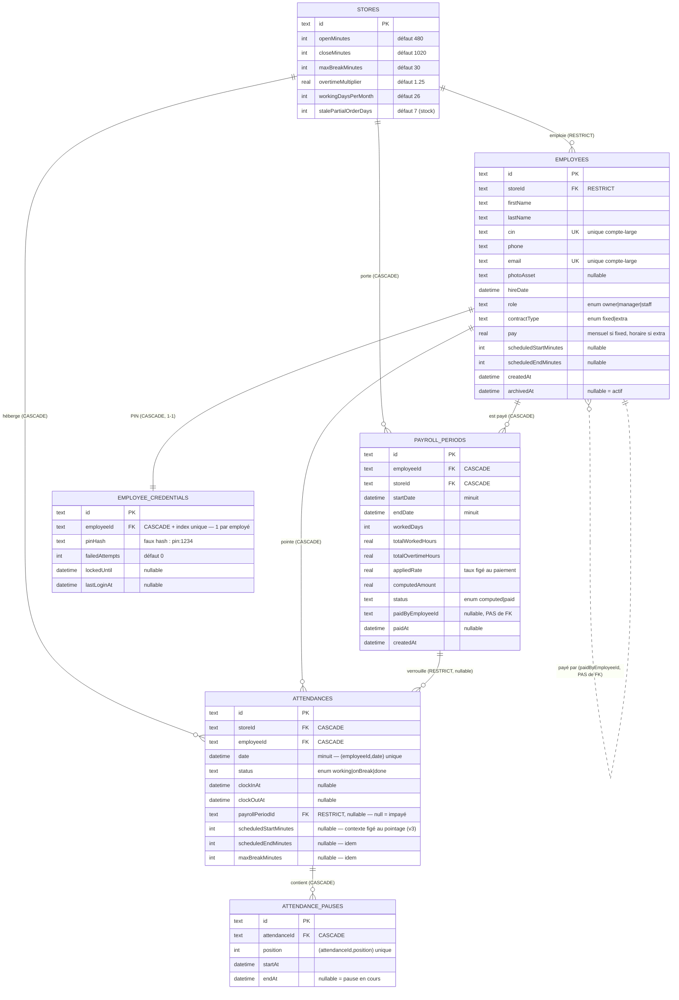

# Gestion des Employés — conception, architecture et logique métier

> Ce document décrit la **couche données** du module Gestion Employée telle qu'elle
> existe après les *Stages 5 à 7* de `phase2-employee.md` : le schéma SQLite (drift),
> les modèles, les mappers, les repositories et la logique de sauvegarde.
>
> **État de la bascule écran :** les repositories sont faits et testés (≈ 741 tests
> verts). Les écrans sous `lib/features/employees/` et `lib/features/auth/` tournent
> encore sur la couche `lib/mock_data/` (mutations + `MockQueries` + `MockSession`) ;
> leur branchement sur les repositories est le *Stage 9*, en attente de la bascule
> écran équivalente côté stock (`phase2.md`). Quand un fichier d'écran est cité
> ci-dessous, c'est **la cible** ; la logique métier décrite, elle, vit déjà dans les
> repositories.

---

## 1. Objectif de cette partie

Le module **Gestion Employée** couvre tout ce qui touche au personnel d'un
établissement :

| Sous-module | Rôle |
|---|---|
| **Personnel (roster)** | Fiche employé : identité, contrat, rémunération, planning, rôle applicatif. Ajout / édition / archivage / restauration. |
| **Authentification (CIN + PIN)** | Connexion à l'application par numéro de carte d'identité + code PIN à 4 chiffres, avec compteur d'échecs et verrouillage temporaire. Rôles : `owner`, `manager`, `staff`. |
| **Pointage (kiosque)** | Tableau de pointage partagé : `Pointer` → `Pause` / `Reprendre` (autant que nécessaire) → `Fin de journée`. Une ligne par employé et par jour calendaire. |
| **Historique de pointage** | Journal filtrable (période, statut, employé) + KPI dérivés : heures travaillées, retards, heures supplémentaires, pauses dépassées. |
| **Paie** | Vue jour par jour des journées terminées non payées, aperçu du montant dû, puis règlement (`Payer`) qui fige un `PayrollPeriod` et verrouille les journées couvertes. |
| **Réglages établissement** | Heures d'ouverture, tolérance de pause, coefficient d'heures supplémentaires, diviseur mensuel — les paramètres contre lesquels le pointage et la paie sont calculés. |

**But de la migration (`phase2-employee.md`) :** faire passer ce module du stockage
en mémoire (`lib/mock_data/`, remis à zéro à chaque redémarrage) vers une base
SQLite locale via **drift**, comme cela a été fait pour la partie stock. Décisions
cadre :

- **Local uniquement.** Pas de backend, pas de vrai hachage, pas de réseau. Le PIN
  reste un « faux hash » (`credential_status.dart : fakePinHash`), la session est
  une ligne `meta`, pas un jeton. La vraie authentification est repoussée à la
  Phase 3.
- **drift**, la base et les conventions existent déjà — ce module ajoute 4 tables
  et étend une table.
- **Données de démo conservées.** `demo_seed.dart` s'enrichit du bloc employé.
- **Suite de tests verte à chaque stage.**

---

## 2. Conception UML — tables et relations

### Diagramme entité-association



### Lecture des relations

| Relation | Cardinalité | `ON DELETE` | Raison |
|---|---|---|---|
| `stores` → `employees` | 1‑N | **RESTRICT** | Un établissement avec du personnel ne peut pas être supprimé. Le domaine n'a aucun flux qui le ferait ; la contrainte transforme cette absence en fait. |
| `employees` → `employee_credentials` | 1‑1 | **CASCADE** + index unique sur `employeeId` | Un credential par employé, il disparaît avec lui. |
| `employees` → `attendances` | 1‑N | **CASCADE** | (Pas de flux réel — archivage seulement — mais la cascade est cohérente.) |
| `employees` → `payroll_periods` | 1‑N | **CASCADE** | Idem. |
| `stores` → `attendances` / `payroll_periods` | 1‑N | **CASCADE** | |
| `attendances` → `attendance_pauses` | 1‑N ordonné | **CASCADE** | Table enfant d'une liste embarquée ; `position` porte l'ordre. |
| `payroll_periods` → `attendances` | 1‑N | **RESTRICT** (FK **nullable** sur `attendances.payrollPeriodId`) | Une période payée ne peut pas être supprimée tant qu'une journée pointe encore dessus. `null` = journée impayée. |
| `employees` → `payroll_periods.paidByEmployeeId` | — | **aucune FK** | L'owner qui a validé peut être archivé plus tard ; la ligne garde son id pour afficher son nom. Même motif que `stock_movements.supplierId`. |

### Invariants imposés par le schéma

- `attendances (employeeId, date)` **unique** → une seule ligne de pointage par
  employé et par jour (l'invariant `mock_data_test` devient une contrainte).
- `attendance_pauses (attendanceId, position)` **unique** → deux `Pause`
  concurrentes ne peuvent pas créer deux fois la position 0 (voir §5 Pointage).
- `employees.cin` **unique**, `employees.email` **unique** — au niveau du compte
  entier, pas par établissement (règle Phase 6 au niveau schéma).
- `PRAGMA foreign_keys = ON` posé dans `beforeOpen` (`app_database.dart:133`) —
  sans ça toutes les `references()` seraient décoratives.

### Index

`employees(storeId)`, `employees(cin)` unique, `employees(email)` unique,
`employee_credentials(employeeId)` unique, `attendances(employeeId, date)` unique,
`attendances(storeId, date)`, `attendance_pauses(attendanceId, position)` unique,
`payroll_periods(employeeId, paidAt)`, `payroll_periods(storeId, paidAt)`.

### Décisions de modélisation transverses

- **`paymentStatus` n'est PAS une colonne.** `attendances` ne porte que
  `payrollPeriodId` (nullable). Le mapper dérive
  `paymentStatus = payrollPeriodId == null ? unpaid : paid`
  (`attendance_mapper.dart:29`). Une seule source de vérité.
- **Aucune durée n'est stockée.** `workedDuration`, `overtimeBy`, `totalBreak`
  sont recalculées à chaque fois à partir de `clockInAt` / `clockOutAt` / pauses.
  Une durée stockée serait une deuxième vérité qui dérive dès qu'un horodatage est
  corrigé.
- **Le *contexte d'évaluation* d'une journée est figé, lui** (schéma v3).
  `attendances` porte `scheduledStartMinutes`, `scheduledEndMinutes`,
  `maxBreakMinutes` — l'horaire résolu (employé ?? magasin) et la tolérance de
  pause **au moment du pointage**. Sans ça, changer les horaires du magasin ou
  l'horaire d'un employé réécrivait rétroactivement le retard, les heures supp. et
  les pauses dépassées de **toutes** les journées passées non payées : une journée
  à l'heure devenait en retard, des heures supp. réelles disparaissaient. Les
  durées restent dérivées ; c'est le *barème* contre lequel on les juge qui est
  gelé. Colonnes `nullable` : une ligne d'avant la v3 (avant le backfill de
  migration) ou que l'écrivain n'a pas pu horodater retombe sur les réglages
  courants — `evaluationContext` (`core/utils/attendance_status.dart`).
  Les coefficients de paie (`overtimeMultiplier`, `workingDaysPerMonth`) ne sont
  **pas** figés sur la journée : ils n'entrent en jeu qu'au paiement, où `pay()`
  fige déjà `computedAmount`. L'écran Réglages avertit avant d'enregistrer un
  changement d'horaires/coefficients tant qu'il reste des journées terminées non
  payées (`PayrollRepository.unpaidFinishedDayCount`).
- **Les heures « de la journée » sont des `int` (minutes depuis minuit).**
  `scheduledStartMinutes`, `openMinutes`… Un `DateTime` mentirait — ce sont des
  heures d'horloge, pas des instants.
- **Ids en UUID v4** (`new_id.dart`) pour les enregistrements créés par l'app ;
  les enregistrements de démo gardent leurs slugs lisibles (`employee-marc`,
  `att-karim-1`, `payroll-seed-karim`).
- **`schemaVersion = 3`.** v1 → v2 : le module Gestion Employée rejoint la base.
  v2 → v3 : les 3 colonnes de contexte d'évaluation sur `attendances`, ajoutées
  par `onUpgrade` (`addColumn` + un `UPDATE` de backfill qui gèle sur chaque
  ligne existante ce qu'elle résout au moment de la mise à niveau). Tout arrive
  par migration, jamais par édition d'un schéma déjà livré. Snapshots dans
  `lib/data/database/migrations/drift_schema_v{1,2,3}.json` ; tests dans
  `migration_test.dart` (v1→v3, v2→v3, et le backfill vérifié ligne par ligne).

---

## 3. Explication de chaque champ

### Table `employees` (`lib/data/database/tables/employees.dart`)

| Champ | Type SQLite | Nullable | Signification |
|---|---|---|---|
| `id` | TEXT (1–64) | non | Clé primaire. UUID v4 pour un ajout via l'app ; slug pour la démo. C'est aussi un segment d'URL potentiel et la valeur de tout `xById`. |
| `storeId` | TEXT | non | FK → `stores.id`, **RESTRICT**. L'établissement d'affectation. Un employé appartient à **un seul** établissement (décision 2 du brief) ; l'owner « couvre » plusieurs magasins en naviguant, pas via une liste ici. |
| `firstName` / `lastName` | TEXT | non | Prénom / nom. Le nom d'affichage `"Prénom Nom"` est dérivé (`employeeDisplayName`). |
| `cin` | TEXT | non | Numéro de carte d'identité nationale. **Identifiant de connexion** (Phase 6) et **unique au niveau du compte**. Comparé normalisé (trim + minuscules, sans repli d'accents) : `" 78.02.14-153.24 "` résout quand même. |
| `phone` | TEXT | non | Téléphone. |
| `email` | TEXT | non | **Unique au niveau du compte.** |
| `photoAsset` | TEXT | oui | Photo de l'employé. `null` → tuile d'initiales. Le formulaire ouvre le sélecteur de fichiers de l'OS (`file_picker`) ; l'image choisie est **copiée** dans `<support>/employee_photos/<id>-<µs>.<ext>` par `EmployeePhotoStore` et c'est ce chemin absolu qui est stocké. `employeePhotoImage()` (`employee_avatar.dart`) distingue un chemin de fichier d'un chemin d'asset ; un fichier disparu retombe sur les initiales. |
| `hireDate` | DATETIME | non | Date d'embauche. **Plancher de paie** : aucune journée antérieure à cette date n'est jamais payable, quoi que dise le filtre de période. |
| `role` | TEXT (enum) | non | `owner` \| `manager` \| `staff`. Voir §permissions. |
| `contractType` | TEXT (enum) | non | `fixed` (salarié, `pay` mensuel) \| `extra` (`pay` horaire). Décide comment `pay` est lu. |
| `pay` | REAL | non | Rémunération. **€ mensuels** si `fixed`, **€/heure** si `extra`. |
| `scheduledStartMinutes` | INTEGER | oui | Heure de début personnelle (minutes depuis minuit). `null` → on utilise `stores.openMinutes`. C'est contre l'« horaire résolu » que retard et heures supp. sont mesurés. |
| `scheduledEndMinutes` | INTEGER | oui | Idem pour la fin de journée (`null` → `stores.closeMinutes`). |
| `createdAt` | DATETIME | non | Création de la fiche. |
| `archivedAt` | DATETIME | oui | `null` = actif. **Seule forme de suppression** — il n'y a pas de hard delete. Posée par `archive`, effacée par `restore`. |

### Table `employee_credentials` (`employees.dart:76`)

| Champ | Type | Nullable | Signification |
|---|---|---|---|
| `id` | TEXT | non | Clé primaire. |
| `employeeId` | TEXT | non | FK → `employees.id`, **CASCADE**, **index unique** → un credential par employé. |
| `pinHash` | TEXT | non | **Faux hash** : `fakePinHash(pin) = "pin:$pin"` (`credential_status.dart:24`). Ne stocke jamais le PIN en clair, mais ce n'est pas cryptographique — Phase 3 remplacera. |
| `failedAttempts` | INTEGER (défaut 0) | non | PIN erronés consécutifs depuis la dernière réussite. Remis à 0 par un PIN correct **ou** un nouveau `pinHash`. |
| `lockedUntil` | DATETIME | oui | Posé quand `failedAttempts` atteint `AuthRules.maxFailedAttempts` (3). Connexion refusée — même avec le bon PIN — jusqu'à ce que cet instant passe (`AuthRules.lockoutDuration` = 5 min). |
| `lastLoginAt` | DATETIME | oui | Dernière connexion réussie. |

### Table `attendances` (`lib/data/database/tables/attendance.dart`)

| Champ | Type | Nullable | Signification |
|---|---|---|---|
| `id` | TEXT | non | Clé primaire. |
| `storeId` | TEXT | non | FK → `stores.id`, **CASCADE**. |
| `employeeId` | TEXT | non | FK → `employees.id`, **CASCADE**. |
| `date` | DATETIME | non | **Normalisée à minuit** — le jour de travail, pas l'instant de création. `(employeeId, date)` unique. |
| `status` | TEXT (enum) | non | `working` \| `onBreak` \| `done`. `notClockedIn` n'est **jamais stocké** : c'est le sens de l'absence de ligne. |
| `clockInAt` | DATETIME | oui | Instant de pointage d'entrée. |
| `clockOutAt` | DATETIME | oui | Instant de `Fin de journée`. `null` tant que la journée n'est pas terminée. |
| `payrollPeriodId` | TEXT | oui | FK → `payroll_periods.id`, **RESTRICT**. `null` = journée impayée. Posé quand une période de paie verrouille la journée ; tant qu'il est posé la ligne est **immuable** (toute écriture de pointage la refuse) et le modèle lit `paymentStatus = paid`. |
| `scheduledStartMinutes` | INTEGER | oui | Minutes depuis minuit. Heure de début résolue (`employee.scheduledStartMinutes ?? store.openMinutes`) **gelée au `clockIn`**. C'est contre elle que `isLate` / `lateBy` mesurent, plus jamais contre les réglages courants. `null` → repli sur l'horaire résolu vivant (`evaluationContext`). |
| `scheduledEndMinutes` | INTEGER | oui | Idem pour la fin de journée — base de `overtimeBy` et du calcul du montant. |
| `maxBreakMinutes` | INTEGER | oui | Tolérance de pause du magasin gelée au `clockIn` — base de `breakOverrun` / `hasLateBreak`. |

### Table `attendance_pauses` (`attendance.dart:64`)

| Champ | Type | Nullable | Signification |
|---|---|---|---|
| `id` | TEXT | non | Clé primaire. Slug `att-<id>-pause-<n>` à la démo ; UUID à l'exécution. |
| `attendanceId` | TEXT | non | FK → `attendances.id`, **CASCADE**. |
| `position` | INTEGER | non | Rang de la pause dans la journée. `(attendanceId, position)` unique. Une table enfant n'a pas d'ordre propre → colonne explicite. |
| `startAt` | DATETIME | non | Début de la pause. |
| `endAt` | DATETIME | oui | Fin. **`null` = pause en cours** (l'employé est `onBreak`), toujours la dernière. |

### Table `payroll_periods` (`lib/data/database/tables/payroll.dart`)

| Champ | Type | Nullable | Signification |
|---|---|---|---|
| `id` | TEXT | non | Clé primaire. |
| `employeeId` | TEXT | non | FK → `employees.id`, **CASCADE**. |
| `storeId` | TEXT | non | FK → `stores.id`, **CASCADE**. |
| `startDate` / `endDate` | DATETIME | non | Première et dernière journée de travail couvertes (minuit). |
| `workedDays` | INTEGER | non | Nombre de journées `done` réglées. |
| `totalWorkedHours` | REAL | non | Somme des heures travaillées. |
| `totalOvertimeHours` | REAL | non | Somme des heures supplémentaires. |
| `appliedRate` | REAL | non | **Instantané de `employee.pay` au moment du paiement** (mensuel si `fixed`, €/h si `extra`). Une augmentation ultérieure ne réécrit pas l'historique. |
| `computedAmount` | REAL | non | Montant total réglé, figé. |
| `status` | TEXT (enum) | non | `computed` \| `paid`. En pratique toujours `paid` : l'aperçu n'est pas persisté. |
| `paidByEmployeeId` | TEXT | oui | Id de l'owner qui a validé. **Pas de FK** (il peut être archivé ; la ligne garde l'id pour afficher le nom). |
| `paidAt` | DATETIME | oui | Instant du paiement. |
| `createdAt` | DATETIME | non | Création de la ligne (= `paidAt` dans le flux actuel). |

### Colonnes ajoutées à `stores` (`lib/data/database/tables/stores.dart:35`)

Le reste de `StoreSettings` (l'ancien `mock_store_settings.dart`, une ligne par
magasin) vit maintenant sur la ligne `stores`. `storeId` + ces 6 champs = tout
l'enregistrement.

| Champ | Type | Défaut | Signification |
|---|---|---|---|
| `openMinutes` | INTEGER | `480` (08:00) | Heure d'ouverture, minutes depuis minuit. Base du retard / des heures supp. pour un employé sans horaire personnel. |
| `closeMinutes` | INTEGER | `1020` (17:00) | Heure de fermeture. |
| `maxBreakMinutes` | INTEGER | `30` | Un **segment de pause** plus long que ça est signalé « pause dépassée ». |
| `overtimeMultiplier` | REAL | `1.25` | Les heures supp. sont payées au taux normal × ce coefficient. |
| `workingDaysPerMonth` | INTEGER | `26` | Diviseur qui transforme le salaire mensuel d'un `fixed` en taux journalier. |
| `stalePartialOrderDays` | INTEGER | `7` | (Côté stock — déjà présent avant ce module.) |

> Les défauts SQLite **sont** les constantes de `core/utils/` (`AttendanceRules.*`,
> `PayrollRules.*`), citées en commentaire dans le schéma pour qu'un changement de
> schéma et un changement de constante ne puissent pas diverger en silence.

### Table `meta` (clé/valeur — `stores.dart:80`)

| Clé | Écrite par | Signification |
|---|---|---|
| `seededAt` | `demo_seed` | Instant d'écriture du jeu de démo — rend ses dates relatives reproductibles. |
| `currentUserName` | seed + `SessionRepository.signIn` | Nom d'affichage attribué à chaque mouvement / changement de prix. |
| `currentEmployeeId` | `SessionRepository.signIn` / `signOut` | **La session.** Id de l'employé connecté, ou absent = déconnecté. Pas un jeton. |

---

## 4. Architecture

```
┌─────────────────────────────────────────────────────────────────────┐
│  lib/features/employees/…  lib/features/auth/…   (ÉCRANS)            │
│  ConsumerWidget / forms — cible Stage 9, encore sur mock_data       │
└───────────────┬─────────────────────────────────────────────────────┘
                │ ref.watch(...) / ref.read(...)
┌───────────────▼─────────────────────────────────────────────────────┐
│  lib/data/providers.dart          providers Riverpod (repos)         │
│  lib/data/current_employee.dart   currentEmployeeProvider (Notifier) │
└───────────────┬─────────────────────────────────────────────────────┘
                │
┌───────────────▼─────────────────────────────────────────────────────┐
│  lib/data/repositories/…    LE SEUL point d'écriture                 │
│  employee · credential · attendance · payroll · session · store     │
│  — transactions, validations, refus des états incorrects            │
└───────────────┬─────────────────────────────────────────────────────┘
        ┌───────┴────────┐
        │                │
┌───────▼──────┐   ┌─────▼───────────────────────────────────────────┐
│ lib/data/    │   │ lib/core/utils/  (FONCTIONS PURES, sans état)   │
│ mappers/…    │   │ employee_status · attendance_status ·           │
│ Row ⇄ modèle │   │ payroll_math · credential_status · permissions  │
└───────┬──────┘   └────────────────────────────────────────────────┘
        │
┌───────▼─────────────────────────────────────────────────────────────┐
│  lib/data/database/  app_database.dart (schéma v2, migration,        │
│  PRAGMA foreign_keys) · tables/…  · migrations/ (snapshots JSON)     │
│  lib/data/seed/demo_seed.dart                                        │
└─────────────────────────────────────────────────────────────────────┘
                │
        SQLite (fichier) — via package drift
```

### Les couches, du bas vers le haut

| Couche | Emplacement | Rôle | Règles |
|---|---|---|---|
| **Modèles** | `lib/models/employee.dart`, `attendance.dart`, `employee_credential.dart`, `payroll_period.dart`, `store_settings.dart` | Classes Dart **immuables**, sans logique, sans annotation drift. | drift génère ses propres `*Row` ; les mappers convertent. Un modèle est « données pures » que le stockage persiste sans y toucher. |
| **Fonctions pures** | `lib/core/utils/` | Toute l'arithmétique métier : `workedDuration`, `overtimeBy`, `isLate`, `hourlyRate`, `dayAmount`, `periodTotals`, `pinMatches`, `isLocked`, `can`, `canAccessStore`. | Opèrent sur des objets déjà chargés. **Ne deviennent jamais des appels repository.** Une seule définition de chaque règle. |
| **Tables** | `lib/data/database/tables/` | Définitions drift (`@DataClassName`, `@TableIndex`, `references(... onDelete:)`). | Times en `int`, aucune durée stockée, `paymentStatus` non colonne, contexte d'évaluation figé sur `attendances`. |
| **Base** | `lib/data/database/app_database.dart` | `@DriftDatabase`, `schemaVersion = 3`, `MigrationStrategy` (`onCreate` / `onUpgrade` v1→v2 puis v2→v3 / `beforeOpen` PRAGMA). | `AppDatabase()` = fichier ; `AppDatabase.memory()` = tests. |
| **Mappers** | `lib/data/mappers/` | `xFromRow(Row) → Model` et `xToRow(Model) → Companion`, un fichier par agrégat. `attendanceFromRows(row, pauseRows)` reconstruit la liste de pauses triée par `position`. | Purs. Autorisés à écrire un `Companion` (c'est là qu'un enregistrement devient une ligne). |
| **Repositories** | `lib/data/repositories/` | **Le seul endroit qui écrit.** Lectures (`Stream<List<T>>` via `.watch()`, `Future<T?>` pour les formulaires), écritures transactionnelles, validations, refus des états incorrects, horloge injectable pour le pointage. | Discipline *un seul écrivain par table*, imposée mécaniquement par `tool/ux_audit.py` (`SINGLE_WRITER_COMPANIONS`). |
| **Providers** | `lib/data/providers.dart`, `lib/data/current_employee.dart` | `Provider<XRepository>` (un par repo), `sessionRepositoryProvider`, `currentEmployeeProvider` (`Notifier<Employee?>`). | `databaseProvider` n'a pas de défaut : `main()` l'override avec le fichier, chaque test avec `AppDatabase.memory()`. |
| **Écrans** | `lib/features/employees/`, `lib/features/auth/` | UI. | *Cible :* `ConsumerWidget` qui `watch` un provider et rend l'`AsyncValue` ; formulaires `ConsumerStatefulWidget` qui `await` l'appel repo avec `if (!mounted) return;`. |

### Discipline « un seul écrivain »

`tool/ux_audit.py` échoue le build si un `Companion` est écrit hors de son
repository (+ son mapper) :

| Companion | Écrivains autorisés |
|---|---|
| `EmployeesCompanion` | `employee_repository.dart`, `employee_mapper.dart` |
| `EmployeeCredentialsCompanion` | `credential_repository.dart`, `credential_mapper.dart` |
| `AttendancesCompanion` / `AttendancePausesCompanion` | `attendance_repository.dart`, `attendance_mapper.dart` |
| `PayrollPeriodsCompanion` | `payroll_repository.dart`, `payroll_mapper.dart` |

`attendance_repository` est autorisé sur `AttendancesCompanion` parce qu'il possède
à la fois le pointage **et** le verrou `payrollPeriodId` que `PayrollRepository.pay`
appelle (`lockForPayroll`).

### Rôles applicatifs (`lib/core/utils/permissions.dart`)

| Capacité | `owner` | `manager` | `staff` |
|---|:--:|:--:|:--:|
| `manageEmployees` (roster) | ✅ | ❌ | ❌ |
| `viewTimeclock` (kiosque) | ✅ | ✅ | ❌ |
| `viewAttendanceHistory` | ✅ | ✅ | ❌ |
| `managePayroll` (+ bouton Payer) | ✅ | ❌ | ❌ |
| `editStoreSettings` | ✅ | ❌ | ❌ |
| `createStore` | ✅ | ❌ | ❌ |
| `spanAllStores` | ✅ | ❌ | ❌ |

Grants **statiques** (déclarés en code, pas stockés par personne).
`canAccessStore(employee, storeId)` = `spanAllStores` **ou**
`employee.storeId == storeId`. Un `staff` n'a **aucun** accès applicatif : son
pointage est fait pour lui au kiosque.

---

## 5. Logique de sauvegarde en base — cas par cas

Principes communs :

- **Toute mutation passe par un repository**, jamais par un écran ou un mapper.
- **Les écritures multi-étapes sont dans une `_db.transaction`** : drift *commit*
  si le callback retourne normalement, *rollback* si une exception est levée.
  Un état à moitié écrit n'existe pas.
- **Chaque méthode refuse l'état antérieur incorrect** en retournant `null` /
  `false` plutôt qu'en le forçant.
- **L'horloge du pointage est injectable** :
  `AttendanceRepository({DateTime Function()? clock})` — `main()` fournit
  `DateTime.now`, `db_fixture.dart` une fonction fixe, et chaque méthode « du jour »
  accepte un override `now` par-dessus.

---

### 5.a — Login (CIN + PIN)

**Écran (cible) :** `lib/features/auth/presentation/pages/login_page.dart`
(`_signIn`). Aujourd'hui il appelle `CredentialMutations.authenticate` +
`MockSession.signIn` ; après le Stage 9 : `CredentialRepository.authenticate`
puis, sur succès, `currentEmployeeProvider.signIn` (→ `SessionRepository`).

**Cœur de la logique :** `CredentialRepository.authenticate(cin, pin, {now})`
— `lib/data/repositories/credential_repository.dart:166`.

```
authenticate(cin, pin, now):
  1. employee = EmployeeRepository(_db).employeeByCin(cin.trim())
        → null          ⇒ LoginAttempt(unknownCin)                [rien écrit]
  2. credential = forEmployee(employee.id)
        → null          ⇒ LoginAttempt(wrongPin, employee)        [rien écrit]
  3. isLocked(credential, now)                                    (credential_status.dart:39)
        → true          ⇒ LoginAttempt(locked, employee)          [rien écrit]
  4. pinMatches(credential, pin)   ==  (pinHash == "pin:" + pin.trim())
        → false ⇒ recordFailedAttempt(employee.id, now)  ← ÉCRITURE
                    failedAttempts += 1
                    si failedAttempts >= AuthRules.maxFailedAttempts (3):
                        lockedUntil = now + AuthRules.lockoutDuration (5 min)
                  ⇒ LoginAttempt(locked | wrongPin, employee)
  5. employee.role == staff
        → true          ⇒ LoginAttempt(noAppAccess, employee)     [compteurs intacts]
  6. recordSuccessfulLogin(employee.id, now)  ← ÉCRITURE
        failedAttempts = 0 ; lockedUntil = null ; lastLoginAt = now
     ⇒ LoginAttempt(success, employee)
```

- `authenticate` **ne touche pas la session** — c'est l'écran qui connecte sur
  `LoginOutcome.success`.
- `recordFailedAttempt` / `recordSuccessfulLogin` sont chacune une seule
  `UPDATE employee_credentials` dans une transaction (`credential_repository.dart:103`
  et `:128`). Toutes les méthodes sensibles à l'horloge prennent `now`.
- **Constantes** (`lib/core/utils/credential_status.dart`) :
  `pinLength = 4`, `maxFailedAttempts = 3`, `lockoutDuration = 5 min`.
- `isValidPin(pin)` = exactement 4 chiffres.

**Sur succès — création de session** (`SessionRepository.signIn`,
`lib/data/repositories/session_repository.dart:47`) :

```
signIn(employeeId):   _db.transaction:
   employee = EmployeeRepository(_db).employee(employeeId)
      → null ⇒ retourne null, rien écrit
   meta[currentEmployeeId] = employeeId          (insertOnConflictUpdate)
   meta[currentUserName]   = employeeDisplayName(employee)
   retourne employee
```

Puis `currentEmployeeProvider` (`lib/data/current_employee.dart`) —
`Notifier<Employee?>` — pose `state = employee` **dans le même geste**, si bien que
le prochain `ref.read` synchrone du garde de routage est déjà correct.
`signOut()` : `DELETE FROM meta WHERE key = 'currentEmployeeId'` + `state = null`.

**Garde de routage** (`lib/app/router.dart : _guard`) : lit la session sur *chaque*
navigation, dans un `redirect` qui ne peut pas `await` — d'où le choix d'un
`Notifier` **hydraté avant la première frame** (`hydrate()` dans `main()`) plutôt
qu'un `FutureProvider`. Le garde applique ensuite `can(...)`, `canAccessStore(...)`
(fonctions pures). *(Ce branchement du garde est le Stage 8/9 ; il lit encore
`MockSession` aujourd'hui.)*

---

### 5.b — Ajout d'un employé, jusqu'au premier pointage

**Écran (cible) :** `lib/features/employees/presentation/pages/add_edit_employee_page.dart`
— `ConsumerStatefulWidget`, `await employeeRepository.create(...)`, puis
`if (!mounted) return;` avant le snackbar. Contrat de retour préservé :
`Future<Employee?>` avec un branchement `if (result == null)` synchrone.

**Cœur :** `EmployeeRepository.create({..., pin})` —
`lib/data/repositories/employee_repository.dart:99`.

```
create(storeId, firstName, lastName, cin, phone, email, role,
       contractType, pay, hireDate?, scheduledStart?/End?, photoAsset?, pin?):

  # validations AVANT la transaction (aucune écriture si elles échouent) :
  - trim de tous les champs texte
  - un champ requis vide (first/last/cin/phone/email) ⇒ null
  - pin fourni mais pas 4 chiffres (isValidPin) ⇒ null

  _db.transaction:
    - employeeByCin(cin)   != null  ⇒ null   (unicité compte-large, comparaison normalisée)
    - employeeByEmail(email) != null ⇒ null
    - INSERT employees  (employeeToRow)
         id = newId() (UUID v4)
         hireDate = hireDate ?? now         ← plancher de paie
         createdAt = now ; archivedAt = null
    - si pin != null :
         CredentialRepository(_db).setPin(employee.id, pin)   (transaction imbriquée = savepoint)
             → INSERT employee_credentials, pinHash = "pin:" + pin
             → null (ne devrait pas arriver ici) ⇒ throw StateError ⇒ ROLLBACK de tout
    - retourne employee
```

Pourquoi `create` fait les deux : *un employé sans credential est quelqu'un qui ne
peut pas se connecter* — ça se lit comme un bug. Le faire ici, en une transaction,
rend cet état **inatteignable**. `pin == null` crée la personne sans credential
(chemin du seed, ou « PIN posé plus tard »).

**Édition** (`update`, `employee_repository.dart:183`) : mêmes validations, dans
une transaction ; **`archivedAt` n'est PAS un paramètre** — l'archivage est sa
propre transition (`archive` / `restore`, `:257`), qui refuse le no-op (archiver
un archivé, restaurer un actif). Aucun hard delete.

**Photo.** Le formulaire garde en état la source fraîchement choisie
(`_pickedPhotoPath`) et un drapeau `_photoCleared` ; rien n'est écrit avant le
submit. Une fois l'`id` connu (après `create` / `update`), `EmployeePhotoStore`
copie le fichier dans le dossier de l'app et `EmployeeRepository.update` écrit le
chemin sur la ligne — une écriture séparée des détails, comme le PIN. Une
suppression appelle `deleteFor(id)` puis `update(clearPhoto: true)`.

**Premier pointage.** L'employé apparaît dans le kiosque
(`timeclock_board_page.dart`, `watchActiveEmployees`). Un `owner`/`manager` tape
`Pointer` sur sa carte :

`AttendanceRepository.clockIn(employeeId, storeId, {now})` —
`lib/data/repositories/attendance_repository.dart:215` :

```
clockIn:
  at  = now ?? clock()
  day = DateTime(at.year, at.month, at.day)     # minuit
  _db.transaction:
    - une ligne existe déjà pour (employeeId, day) ? ⇒ null   (+ index unique en filet)
    - résout le contexte d'évaluation MAINTENANT :
        settings = StoreRepository.settings(storeId)
        schedule = resolvedSchedule(employee, settings.open, settings.close)
    - INSERT attendances :
        id = newId()
        date = day
        status = working
        clockInAt = at
        pauses = []            (aucune ligne attendance_pauses)
        payrollPeriodId = null → paymentStatus dérivé = unpaid
        scheduledStartMinutes = schedule.startMinutes   ← gelé
        scheduledEndMinutes   = schedule.endMinutes     ← gelé
        maxBreakMinutes       = settings.maxBreakMinutes ← gelé
    - retourne l'Attendance
```

À partir de là, la carte affiche `Pause` / `Fin de journée`. Une journée sans
ligne = `notClockedIn` (jamais stocké).

---

### 5.c — Pointage : règles de calcul et logique

#### Machine à états (écritures — `attendance_repository.dart`)

| Action | Méthode | Pré-condition | Effet | Nouveau statut |
|---|---|---|---|---|
| `Pointer` | `clockIn` | aucune ligne ce jour | INSERT `attendances` | `working` |
| `Pause` | `startPause` | statut `working` | INSERT `attendance_pauses` à `position = count`, `startAt = now`, `endAt = null` | `onBreak` |
| `Reprendre` | `endPause` | statut `onBreak` + une pause ouverte | UPDATE de la pause ouverte : `endAt = now` | `working` |
| `Fin de journée` | `clockOut` | statut `working` (refuse pendant `onBreak`) | UPDATE `attendances.clockOutAt = now` | `done` |
| (verrou paie) | `lockForPayroll` | appelée **uniquement** par `PayrollRepository.pay` | UPDATE `payrollPeriodId` | inchangé |

- **Pas de limite de pauses** : le bouton propose `Pause` de nouveau après chaque
  `Reprendre`.
- **CIN à chaque action.** Chaque bouton du kiosque (`Pointer`, `Pause`,
  `Reprendre`, `Fin de journée`) ouvre d'abord `IdentityPromptDialog`, qui
  demande le **numéro CIN** (identifiant unique) de l'employé de la carte et le
  vérifie via `CredentialRepository.verifyCin(cin, employee.id)`. **Pas de
  PIN** ici : la demande client est une confirmation par CIN. L'écriture de
  pointage ne part que sur un CIN confirmé. `verifyCin` est **strict** — le CIN
  saisi doit résoudre exactement à l'employé de la carte ; tout autre CIN,
  valide ou non, compte comme faux. Il rejoue la machine à états de
  `authenticate` (3 essais → `lockedUntil = now + 5 min`, verrou porté sur la
  ligne `employee_credentials` de l'employé attendu) et **repart sur 3 essais**
  dès qu'un verrou est expiré. Aucun contournement owner/gérant : un employé
  verrouillé attend les 5 min. La vérification est côté UI (cohérent avec « auth
  reste fake ») — les writes de `attendance_repository.dart` gardent leur unique
  écrivain. *Note : le CIN est affiché sur la carte du kiosque — c'est une
  confirmation d'intention, pas un secret.*
- **Journée verrouillée = immuable.** Le helper privé `_mutate`
  (`attendance_repository.dart:337`) ouvre la transaction, lit la ligne, et refuse
  (`null`) si elle est absente **ou** si `payrollPeriodId != null`. `startPause` /
  `endPause` / `clockOut` passent tous par lui.
- **Concurrence (double-tap sur `Pause`).** `startPause` lit le nombre de pauses
  puis insère à cette position — **dans** la transaction. drift sérialise les
  transactions : la 1ʳᵉ insère la position 0 et passe à `onBreak`, la 2ᵈ relit,
  voit `onBreak`, refuse → une seule pause. Sans la transaction, les deux voient
  `count = 0`, insèrent la position 0, et l'index unique
  `(attendanceId, position)` lève `SqliteException(2067)`.
- **Écritures via l'API typée** (`_db.into(...).insert`, `_db.update(...).write`),
  jamais `customStatement` — celui-ci ne notifie pas les streams que le tableau de
  pointage observe.

#### Dérivations (`lib/core/utils/attendance_status.dart` — pures, non stockées)

Toutes recalculées à partir des horodatages. Le **barème** (heures de début/fin,
tolérance de pause) vient de `evaluationContext(entry, fallback…)` : les colonnes
gelées de la ligne, ou l'horaire résolu vivant si elles sont `null` (ligne
d'avant la v3). `stats()`, l'historique et l'aperçu de paie passent tous par là —
un changement de réglages ne bouge plus une journée déjà pointée.

| Fonction | Règle |
|---|---|
| `totalBreak(entry)` | Σ des pauses **terminées** (`endAt` non nul) : `endAt − startAt`. Une pause en cours ne compte pas. |
| `hasOpenBreak(entry)` | une pause a `endAt == null`. |
| `resolvedSchedule(employee, storeOpen, storeClose)` | `(startMinutes: employee.scheduledStartMinutes ?? storeOpen, endMinutes: employee.scheduledEndMinutes ?? storeClose)`. |
| `workedDuration(entry)` | `null` tant que `clockOutAt` est nul. Sinon `clockOutAt − clockInAt − totalBreak`, **planché à 0** (jamais négatif). |
| `lateBy(entry, startMin)` | `null` sans `clockInAt`. Sinon `minutesDuJour(clockInAt) − startMin − lateGrace(5 min)`, planché à 0. |
| `isLate(entry, startMin)` | `lateBy > 0`. **Seul endroit** où la marque « en retard » est décidée. |
| `overtimeBy(entry, endMin)` | `null` sans `clockOutAt`. Sinon `minutesDuJour(clockOutAt) − endMin`, planché à 0. |
| `breakOverrun(pause, maxMin)` | `(endAt − startAt) − maxMin`, planché à 0 ; 0 si la pause tourne encore. |
| `hasLateBreak(entry, maxMin)` | au moins **un segment** dépasse `maxMin`. **Seul endroit** où « pause dépassée » est décidé. C'est le *segment*, pas le total. |
| `totalBreakOverrun(entry, maxMin)` | Σ des dépassements de chaque segment. |

`lateGrace = 5 min` (`AttendanceRules.lateGrace`) : arriver dans les 5 min après
l'heure prévue n'est pas « en retard ».

#### Historique & KPI

`AttendanceRepository.page(...)` (`attendance_repository.dart:89`) : une requête
filtrée (`from`/`to` bornes de jour inclusives, `status`, `employeeId`, combinés en
ET), triée `date DESC, clockInAt DESC`, paginée en Dart (la table est petite et il
faut de toute façon le total).

`AttendanceRepository.stats(...)` (`:168`) : **SQL pour le fetch, Dart pour
l'arithmétique.** Une requête ramène les lignes + pauses de la période ;
`_schedulesFor` construit une map `employeeId → horaire résolu` (une requête, pas
une par ligne) ; puis un pli en Dart avec les fonctions pures ci-dessus donne
`{days, worked, lateArrivals, overtime, lateBreaks}`. L'arithmétique reste une
seule définition.

---

### 5.d — Paiement : règles de calcul et logique

**Écran (cible) :** `lib/features/employees/presentation/pages/payroll_history_page.dart`
— `watchDays(...)` pour le tableau, puis le flux « Payer » :
`preview` (future) → `ConfirmDialog` → **`IdentityPromptDialog`** → `pay` →
snackbar. `paidByEmployeeId` = l'id de `currentEmployeeProvider` ; c'est ce
CIN-là que `IdentityPromptDialog` vérifie (`verifyCin(cin, actorId)`, même
verrou 3 essais / 5 min que le kiosque) — le règlement ne part que sur CIN
confirmé, et le CIN doit être celui de l'utilisateur connecté.

**Arithmétique** — `lib/core/utils/payroll_math.dart` (pure, inchangée) :

| Fonction | Règle |
|---|---|
| `hourlyRate(employee, settings)` | `extra` : `employee.pay` (déjà €/h). `fixed` : `(pay / settings.workingDaysPerMonth) / 8h × 60` — salaire mensuel ÷ jours ouvrés ÷ journée standard de 8 h. |
| `dayAmount(day, employee, settings, {scheduledEndMinutes})` | `0` si `day.status != done`. Sinon : `worked = workedDuration(day)` (0 si `null`) ; `overtime = overtimeBy(day, scheduledEndMinutes) ?? 0` ; `rate = hourlyRate` ; `premium = (settings.overtimeMultiplier − 1) × rate × heures(overtime)` ; **résultat = `rate × heures(worked) + premium`**. |
| `periodTotals(days, employee, settings)` | Sur les journées `done` : compte, Σ `workedDuration`, Σ `overtimeBy` (contre `resolvedSchedule(...).endMinutes`). Retourne `{days, workedHours, overtimeHours}`. |
| `periodAmount(days, employee, settings)` | Σ `dayAmount(day, ...)`. |

> **Pas de gestion d'absence** (décision client, Phase 3) : un salarié `fixed` est
> payé au taux journalier pour **chaque jour réellement travaillé**, plus la prime
> d'heures supp. Aucune retenue pour absence injustifiée.

**Aperçu** — `PayrollRepository.preview(employeeId, storeId, {from, to})`
(`lib/data/repositories/payroll_repository.dart`) : résout l'employé + les réglages,
appelle `_payableDays`, applique `periodTotals` / `periodAmount`. **Ne persiste
rien.** Retourne `PayrollPreview{days, workedHours, overtimeHours, amount,
appliedRate}`.

**Jours payables** — `_payableDays(employeeId, storeId, hireDate, {from, to})` :

```
SQL : WHERE employeeId = ? AND storeId = ? AND status = 'done'
                             AND payrollPeriodId IS NULL
Dart : plancher bas = max(from, hireDate)        (jamais avant l'embauche)
       borne haute  = to
       _assemble attache les pauses (nécessaires à periodTotals/periodAmount)
       tri date DESC
```

**Paiement** — `PayrollRepository.pay(employeeId, storeId, {from, to,
paidByEmployeeId, now})` :

```
employee = EmployeeRepository(_db).employee(employeeId)   → null ⇒ null
settings = StoreRepository(_db).settings(storeId)
at = now ?? DateTime.now()

try:
  _db.transaction:                                    ← UNE seule transaction
    days = _payableDays(...)                          → vide ⇒ return null
    totals = periodTotals(days, employee, settings)
    dates  = jours triés
    period = PayrollPeriod(
        id = newId(),
        startDate = dates.first, endDate = dates.last,
        workedDays = totals.days,
        totalWorkedHours = totals.workedHours,
        totalOvertimeHours = totals.overtimeHours,
        appliedRate = employee.pay,                   ← TAUX FIGÉ
        computedAmount = periodAmount(days, employee, settings),
        status = paid,
        paidByEmployeeId = paidByEmployeeId,
        paidAt = at, createdAt = at)

    # 1) la ligne période D'ABORD — attendances.payrollPeriodId est une FK RESTRICT
    #    vers elle : le verrou ne peut pas poser un id qui n'existe pas encore
    INSERT payroll_periods (payrollPeriodToRow(period))

    # 2) verrou des journées, DANS la même transaction (savepoint)
    locked = AttendanceRepository(_db).lockForPayroll(days.ids, period.id)
        lockForPayroll : SELECT les lignes par id
            si count ≠ ids.length OU une a déjà payrollPeriodId ⇒ false, rien touché
            sinon UPDATE attendances.payrollPeriodId = period.id
    si !locked ⇒ throw _PayrollAborted   ⇒  ROLLBACK complet (période + verrou)

    return period
except _PayrollAborted:
  return null
```

- **`appliedRate` fige le taux.** Une augmentation ultérieure
  (`employee_repository.update(pay: …)`) ne bouge pas une période déjà payée.
- **Atomicité prouvée.** drift *commit* si le callback retourne, *rollback* si une
  exception est levée — d'où le sentinel privé `_PayrollAborted` (plutôt qu'un
  `return null` qui, lui, committerait la ligne période déjà insérée). Test : deux
  `pay` concurrents sur la même plage → drift les sérialise, le 2ᵈ trouve
  `_payableDays` vide et retourne `null` → **une seule** période. En remplaçant
  `_db.transaction` par `Future.sync`, on obtient **deux** périodes de 208 € pour
  les deux mêmes jours (les dents du test).
- **Permanence.** Une période `paid` n'est jamais éditée ni supprimée ; la FK
  `RESTRICT` empêche de supprimer une période tant qu'une journée pointe dessus ;
  les journées couvertes deviennent immuables (`_mutate` les refuse).

**Vue jour par jour** — `PayrollRepository.days(storeId, {employeeId, from, to,
status, page, pageSize})` (`payroll_repository.dart`, déjà livrée au Stage 3) :
`employeeId` nul = tous les employés **actifs** ; SQL ramène les lignes `done` +
pauses, Dart résout l'horaire de chacun et plie `workedDuration` / `overtimeBy`.
Les compteurs `paidDays` / `unpaidDays` et les totaux d'heures sont **sur toute la
plage**, indépendants du filtre `status` du tableau — les KPI restent visibles quoi
que le tableau affiche.

---

### 5.e — Réglages établissement

`StoreRepository.updateStoreSettings(storeId, {openMinutes, closeMinutes,
maxBreakMinutes, overtimeMultiplier, workingDaysPerMonth})` —
`lib/data/repositories/store_repository.dart`.

- **Une seule `UPDATE stores`.** Un champ à `null` **et** un champ à valeur absurde
  (négatif, heure ≥ 1440, multiplicateur < 1) produisent le même résultat : colonne
  **inchangée**. `Value.absent()` dans les deux cas → pas besoin de lire la ligne
  d'abord. Retourne `settings(storeId)` (l'enregistrement fraîchement relu).
- Posture « indulgente » : un champ à moitié saisi ne bloque pas l'enregistrement
  du reste. `stalePartialOrderDays` garde sa propre méthode
  (`setStalePartialOrderDays`), qui *refuse* un nombre non positif.
- `settings(storeId)` synthétise un enregistrement par défaut (constantes
  `core/utils/`) si la ligne n'existe pas.
- **Avertissement rétroactivité.** Avant d'enregistrer un changement d'horaires
  ou de coefficients, `store_settings_page._save` appelle
  `PayrollRepository.unpaidFinishedDayCount(storeId)` ; s'il reste des journées
  terminées non payées, un `ConfirmDialog` prévient que leur retard / heures
  supp. / montant estimé vont changer (l'horaire figé les protège déjà pour le
  retard et les heures supp. ; les coefficients, eux, ne sont figés qu'au
  paiement). L'utilisateur peut « Changer quand même » ou aller payer d'abord.

---

## 6. Où les données sont physiquement sauvegardées — le fichier SQLite

### Le moteur

- **drift** est la couche requêtes ; en dessous, le paquet **`sqlite3`** exécute
  contre une vraie base SQLite native (bundlée par `sqlite3_flutter_libs` dans
  l'app compilée).
- Le point d'ouverture unique : `lib/data/database/app_database.dart:69`
  ```dart
  AppDatabase() : super(driftDatabase(name: databaseName)); // databaseName = 'stock_inventory'
  ```
  Aucune option `native:` personnalisée n'est passée → comportement **par défaut**
  de `drift_flutter` (0.2.8).

### Emplacement du fichier

`drift_flutter` place, sur plateforme native, un fichier **`stock_inventory.sqlite`**
dans le dossier retourné par **`getApplicationDocumentsDirectory()`** de
`path_provider`. **Un seul fichier pour toute l'application** (stock *et* employés,
19 tables au total).

| Plateforme | Chemin du fichier | Remarques |
|---|---|---|
| **Windows** | `C:\Users\<utilisateur>\Documents\stock_inventory.sqlite` | Dossier « Documents » de l'utilisateur (`FOLDERID_Documents`). Sur cette machine : `C:\Users\Administrateur\Documents\stock_inventory.sqlite`. |
| **Android** | `/data/data/com.clientproject.stock_inventory/app_flutter/stock_inventory.sqlite` | Stockage **interne privé** de l'app : invisible aux autres apps et à l'utilisateur (sans root), effacé à la désinstallation. |
| **iOS** | `<bac à sable de l'app>/Documents/stock_inventory.sqlite` | Bundle `com.clientproject.stockInventory`. Inclus dans les sauvegardes iCloud / iTunes. |
| **macOS** | `~/Library/Containers/com.clientproject.stockInventory/Data/Documents/stock_inventory.sqlite` | App sandboxée. |
| **Linux** | `~/Documents/stock_inventory.sqlite` (ou `$XDG_DOCUMENTS_DIR`) | |

SQLite crée aussi, à côté, les fichiers de journal **`stock_inventory.sqlite-wal`**
et **`stock_inventory.sqlite-shm`** (mode WAL). Les trois forment la base ; ne
copier que le `.sqlite` d'une base ouverte peut perdre les dernières écritures.

> Le nom `stock_inventory` est figé (`AppDatabase.databaseName`) : le changer
> orphelinerait les données de chaque installation existante.

### Cycle de vie du fichier

| Moment | Ce qui se passe | Code |
|---|---|---|
| **1er lancement** | `main()` → `openAppDatabase()` ouvre/crée le fichier → `MigrationStrategy.onCreate` crée les 19 tables → `seedIfEmpty` : si la table `stores` est vide, `seedDemoData` écrit le jeu de démo (stock + employés) en une transaction. | `lib/main.dart`, `lib/data/database/bootstrap.dart`, `lib/data/seed/demo_seed.dart` |
| **Lancements suivants** | Le fichier existe et contient des établissements → `seedIfEmpty` ne fait **rien**, les données de l'utilisateur sont conservées. `beforeOpen` exécute `PRAGMA foreign_keys = ON` à chaque ouverture. | `app_database.dart:133` |
| **Install v1 mise à niveau** | `onUpgrade` (from < 2) : `createTable` des 5 tables employé + leurs 9 index + `addColumn` des 5 colonnes de pointage/paie sur `stores`, avec les défauts = constantes `core/utils/`. | `app_database.dart:99` |
| **Réinitialiser la démonstration** | `DemoRepository.resetDemo()` : `clearAllData` (DELETE de toutes les tables, en ordre FK inverse) puis `seedDemoData` **ré-ancré à maintenant**, le tout en une transaction. Le fichier reste, son **contenu** est remplacé. | `lib/data/repositories/demo_repository.dart` |
| **Désinstallation de l'app** | Le fichier part avec le stockage privé de l'app (Android/iOS). Sur desktop il reste dans « Documents » jusqu'à suppression manuelle. | — |

### En test — aucun fichier

Les tests n'écrivent **jamais** sur disque : `AppDatabase.memory()` →
`NativeDatabase.memory()` → base entièrement en RAM, détruite à la fin de chaque
test (`test/support/db_fixture.dart`). Sous `flutter test` (VM Dart, sans plugins),
`sqlite3` est pointé sur `winsqlite3.dll` du système sur Windows
(`test/support/sqlite.dart`), et sur la lib système sur Linux/macOS.

### Confidentialité

**Le fichier n'est pas chiffré** (pas de SQLCipher). Il s'ouvre avec n'importe
quel outil SQLite (`sqlite3` en ligne de commande, *DB Browser for SQLite*…). Le
`pinHash` est un faux hash (`pin:1234`). C'est un choix assumé du périmètre : la
Phase 3 (backend + vraie authentification) traitera le chiffrement et le stockage
des secrets.

---

## Emplacements — récapitulatif

| Sujet | Fichier(s) |
|---|---|
| Schéma, migration v1→v2, `PRAGMA foreign_keys` | `lib/data/database/app_database.dart` |
| Définitions de tables | `lib/data/database/tables/{employees,attendance,payroll,stores}.dart` |
| Snapshots de schéma | `lib/data/database/migrations/drift_schema_v{1,2,3}.json` |
| Modèles | `lib/models/{employee,attendance,employee_credential,payroll_period,store_settings}.dart` |
| Règles pures | `lib/core/utils/{employee_status,attendance_status,payroll_math,credential_status,permissions}.dart` |
| Mappers | `lib/data/mappers/{employee,credential,attendance,payroll,store}_mapper.dart` |
| Repositories | `lib/data/repositories/{employee,credential,attendance,payroll,session,store}_repository.dart` |
| Photo employé (fichiers) | `lib/data/employee_photo_store.dart`, `employeePhotoImage()` dans `lib/shared/widgets/employee_avatar.dart` |
| Dialog CIN (kiosque + paie) | `lib/shared/widgets/identity_prompt_dialog.dart` ; `CredentialRepository.verifyCin` |
| Session (Notifier) | `lib/data/current_employee.dart` |
| Providers | `lib/data/providers.dart` |
| Seed de démo | `lib/data/seed/demo_seed.dart` |
| Garde `unique writer` | `tool/ux_audit.py` (`SINGLE_WRITER_COMPANIONS`) |
| Tests | `test/db/{schema,migration,employee_seed,employee_queries,employees,auth,attendance,payroll,store_settings}_test.dart`, `test/employee_photo_store_test.dart`, `test/components_test.dart` (IdentityPromptDialog), `test/payroll_history_page_test.dart` |
| Écrans (cible Stage 9) | `lib/features/employees/presentation/pages/`, `lib/features/auth/presentation/pages/login_page.dart`, `lib/features/settings/presentation/pages/store_settings_page.dart`, `lib/app/router.dart` (`_guard`) |
| Plan de migration + journaux « As built » | `phase2-employee.md` |
